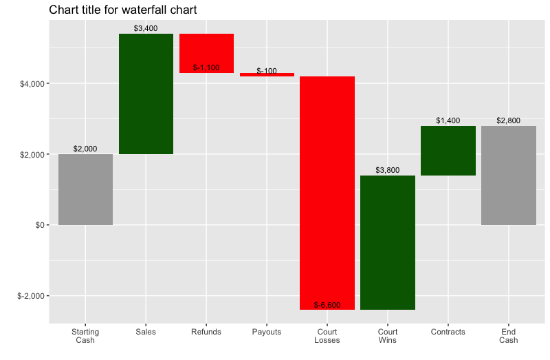

# WaterfallCharts
Create waterfall charts using R &amp; ggplot2.

## What this is ?
[Waterfall charts][1] show the incremental impact of event or activities. They are commonly used in consulting and business presentations.

For example, the following chart show the cash balance at the start of a period and all the inflows and outflows of cash during the period due to each factor (sales, refunds, payouts, court losses, court wins, contracts) and finally the ending cash position.

[1]: https://en.wikipedia.org/wiki/Waterfall_chart "Wikipedia: Waterfall Chart"

